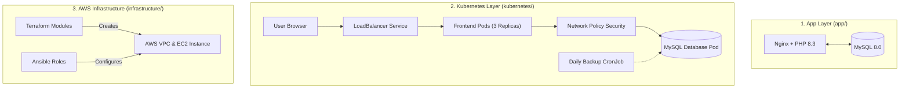

# LAMP Stack Deployment & Infrastructure Automation

This repository provides an enterprise-grade, production-ready LAMP (Linux, Nginx, MySQL, PHP) stack deployment powered by **Docker**, **Kubernetes**, **Terraform**, and **Ansible**.

---

## 📐 How Everything Works Together



---

## 📂 Project Organization

I organized the project into 3 main folders to keep things clean and easy to follow:

| Folder | What's Inside |
|---|---|
| [`app/`](./app) | Dockerfile, Nginx config, PHP application script, and local Docker Compose file. |
| [`kubernetes/`](./kubernetes) | Kubernetes manifests (Deployment, StatefulSet, Services, ConfigMaps, Secrets, HPA, NetworkPolicy, Backup CronJob). |
| [`infrastructure/`](./infrastructure) | Terraform scripts to create AWS resources (VPC, Security Group, EC2, Secrets Manager) and Ansible playbooks/roles to set up Nginx, PHP, and MySQL. |

---

## 🚀 How to Run & Test

### Option 1: Run locally with Docker
```bash
cd app
docker compose up --build -d
```
Then open `http://localhost` in your browser. You will see the page connect to MySQL and print a success message.

### Option 2: Deploy to Kubernetes
```bash
cd kubernetes
kubectl apply -f namespace.yaml
kubectl apply -f secret.yaml -f configmap.yaml
kubectl apply -f mysql-pv.yaml -f mysql-statefulset.yaml -f mysql-networkpolicy.yaml
kubectl apply -f frontend-deployment.yaml -f frontend-service.yaml
kubectl apply -f frontend-hpa.yaml -f mysql-hpa.yaml
kubectl apply -f mysql-backup-cronjob.yaml
```

### Option 3: Provision on AWS with Terraform & Ansible
```bash
# 1. Create AWS resources with Terraform
cd infrastructure/terraform
terraform init
terraform apply -var="key_name=your-ssh-key-name"

# 2. Configure the EC2 instance with Ansible
cd ../ansible
ansible-playbook -i inventory.ini playbook.yml
```

---

## 🔒 Security Highlights

- **Non-Root Containers**: The Docker container runs as `USER nginx` instead of root for safety.
- **Database Protection**: Kubernetes NetworkPolicy blocks any outside access to MySQL. Only the frontend app pods can talk to the database.
- **Secrets Management**: Passwords and keys are never hardcoded. In Terraform, database passwords are randomly created and saved securely in AWS Secrets Manager.
- **Automated Backups**: Includes a daily Kubernetes `CronJob` to backup the database and keep 7 days of backups.
- **Clean Git History**: No passwords, access keys, or sensitive `.env` files are tracked in Git.
