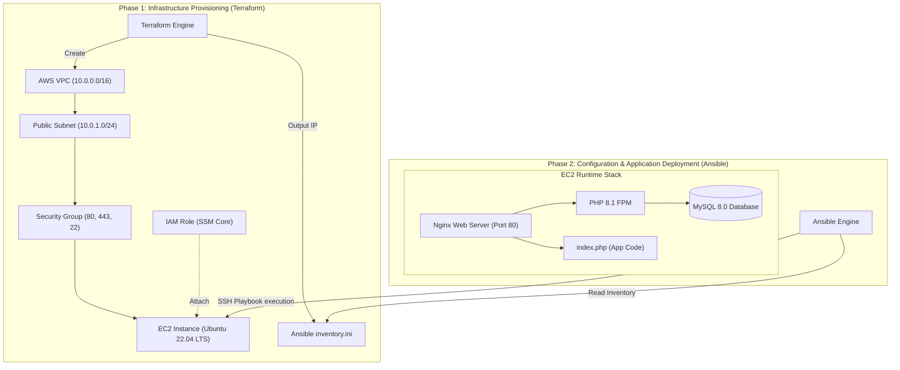

# Task 3 (Bonus) — Terraform + Ansible: LAMP on EC2

Terraform provisions the AWS infrastructure (VPC, subnet, security group,
IAM role, EC2 instance). Ansible then configures the instance with
Nginx + PHP-FPM + MySQL and deploys the sample PHP application.



## Prerequisites
- Terraform >= 1.5, AWS CLI configured with credentials (`aws configure`)
- An existing EC2 key pair in the target region (for SSH)
- Ansible >= 2.14, and the `community.mysql` collection:
  ```bash
  cd ansible
  ansible-galaxy collection install -r requirements.yml
  ```

## Step 1 — Provision infrastructure with Terraform

```bash
cd terraform
terraform init
terraform apply -var="key_name=your-ec2-key-pair-name" -var="ssh_cidr=YOUR.IP.ADDR.ESS/32"
```

This creates:
- A VPC (`10.0.0.0/16`) with a public subnet, Internet Gateway, and route table
- A Security Group allowing inbound HTTP (80), HTTPS (443), and SSH (22, restricted to `ssh_cidr`)
- An IAM role + instance profile (SSM managed-instance access, for future patching/automation)
- One Ubuntu 22.04 EC2 instance (`t2.micro` by default)
- An `ansible/inventory.ini` file, generated automatically with the instance's public IP

Note the `instance_public_ip` output — you'll use it to reach the app.

## Step 2 — Configure the instance with Ansible

```bash
cd ../ansible
# Wait ~30-60s after apply for the instance to finish booting/SSH to come up
ansible-playbook -i inventory.ini playbook.yml
```

The playbook:
1. Installs Nginx, MySQL Server, PHP-FPM, and the PHP MySQL extension
2. Starts and enables MySQL, sets the root password, creates the app database and app user
3. Starts and enables PHP-FPM
4. Templates an Nginx server block that proxies `.php` requests to PHP-FPM, enables it, removes the default site, reloads Nginx
5. Deploys `index.php`, templated with the DB credentials, to `/var/www/html`
6. All services are enabled (`enabled: true`) so they start automatically on reboot

To override credentials instead of using the defaults in `playbook.yml`:
```bash
ansible-playbook -i inventory.ini playbook.yml \
  -e "db_password=my-secret" -e "mysql_root_password=my-root-secret"
```
(For real use, store these with `ansible-vault` rather than passing on the CLI.)

## Step 3 — Verify

```bash
curl http://<instance_public_ip>/
```
You should see:
> Hello, World! Your MySQL connection is successful.

## Tear down

```bash
cd ../terraform
terraform destroy -var="key_name=your-ec2-key-pair-name"
```

## Design choices & assumptions
- **Ubuntu 22.04 LTS** via the official Canonical AMI (looked up dynamically
  with a `data "aws_ami"` filter, so it always resolves to the latest patch
  in the region rather than a hardcoded, potentially stale AMI ID).
- **`t2.micro`** default instance type — free-tier eligible; override with
  `-var="instance_type=..."` for production sizing.
- **MySQL installed directly on the instance** (not RDS) per the task
  description ("deploy the LAMP stack... on this instance"). For production,
  an RDS instance in a private subnet would be preferable for
  durability/backups/HA.
- **SSH access restricted via `ssh_cidr` variable** — defaults to
  `0.0.0.0/0` for convenience but should always be set to your own IP/32 in
  practice; only HTTP/HTTPS are open to the world by default.
- **IAM role** grants only `AmazonSSMManagedInstanceCore` (Session Manager
  access) — least-privilege, no broad resource-management permissions,
  since the task didn't specify the instance needs to manage other AWS
  resources itself.
- **Ansible `community.mysql` collection** used for idempotent DB/user
  creation instead of raw shell commands.
