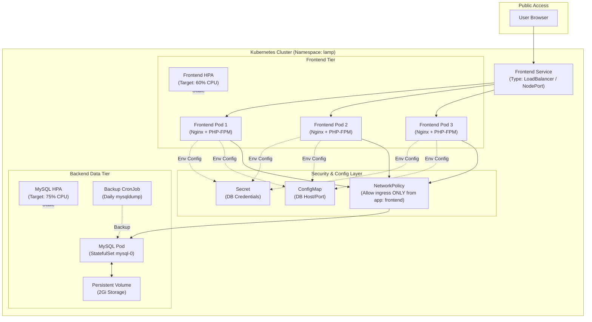

# Task 2 — Kubernetes Deployment of the LAMP Stack

## Architecture



- **frontend** — `Deployment`, 3 replicas, Nginx + PHP-FPM (image from Task 1),
  exposed via a `LoadBalancer`/`NodePort` `Service`.
- **mysql** — `StatefulSet`, 1 primary replica, persistent storage via a
  `volumeClaimTemplate`, exposed only internally via a headless `Service`
  (`clusterIP: None`) and locked down further with a `NetworkPolicy` that
  only allows ingress from pods labeled `app: frontend`.
- Credentials live in a `Secret`; non-sensitive connection details (host,
  port) live in a `ConfigMap`.
- Both tiers have readiness/liveness probes, resource requests/limits, and
  Horizontal Pod Autoscalers.

## Prerequisites
- A cluster with at least 2 nodes: Minikube (`minikube start --nodes 2`),
  `kind` with a multi-node config, k3s with agents, or a cloud cluster (EKS/GKE/AKS).
- `kubectl` configured against the cluster.
- The `metrics-server` addon installed (required for HPA):
  ```bash
  minikube addons enable metrics-server
  # or: kubectl apply -f https://github.com/kubernetes-sigs/metrics-server/releases/latest/download/components.yaml
  ```
- The Task 1 image pushed to a registry you can pull from, e.g.:
  ```bash
  cd ../task-1-docker
  docker build -t yourdockerhubuser/lamp-web:1.0 .
  docker push yourdockerhubuser/lamp-web:1.0
  ```
  Then update the `image:` field in `frontend-deployment.yaml` accordingly.

## Deploy

Apply manifests in order (or `kubectl apply -f .` since names don't collide,
but ordering below avoids "namespace not found" warnings on a first run):

```bash
kubectl apply -f namespace.yaml
kubectl apply -f secret.yaml
kubectl apply -f configmap.yaml
kubectl apply -f mysql-pv.yaml          # only needed for hostPath/manual storage classes
kubectl apply -f mysql-statefulset.yaml
kubectl apply -f mysql-networkpolicy.yaml
kubectl apply -f frontend-deployment.yaml
kubectl apply -f frontend-service.yaml
kubectl apply -f frontend-hpa.yaml
kubectl apply -f mysql-hpa.yaml
```

Check status:
```bash
kubectl get all -n lamp
kubectl get hpa -n lamp
```

## Access the app

- **Cloud cluster (LoadBalancer):**
  ```bash
  kubectl get svc frontend -n lamp
  # open the EXTERNAL-IP shown
  ```
- **Minikube:**
  ```bash
  minikube service frontend -n lamp
  ```
- **kind/k3s without a cloud LB:** edit `frontend-service.yaml`, set
  `type: NodePort` and uncomment `nodePort: 30080`, re-apply, then browse to
  `http://<any-node-ip>:30080`.

## Zero-downtime rolling update

```bash
kubectl set image deployment/frontend frontend=yourdockerhubuser/lamp-web:1.1 -n lamp
kubectl rollout status deployment/frontend -n lamp
```
`maxUnavailable: 0` / `maxSurge: 1` in the Deployment spec ensures a new pod
is ready before an old one is terminated, combined with the readiness probe
gating traffic.

## Design choices & assumptions
- **MySQL 8.0** (official image) — matches Task 1 and is the current stable
  MySQL GA line.
- **StatefulSet over Deployment for MySQL** — gives it a stable network
  identity and a per-pod PVC via `volumeClaimTemplates`, which is the
  standard pattern for stateful data services in Kubernetes.
- **`storageClassName: manual` + a static `hostPath` PV** was used so this
  works out of the box on Minikube/kind without depending on a specific
  cloud CSI driver. On a real cloud cluster, replace this with the
  provider's default `StorageClass` (e.g. `gp2`/`gp3` on EKS) and drop
  `mysql-pv.yaml` — the `volumeClaimTemplate` will dynamically provision the
  PV for you.
- **MySQL "HPA"**: `mysql-hpa.yaml` is included to satisfy the "both
  services" scaling requirement, but scaling a single-primary MySQL
  StatefulSet horizontally does not create read replicas automatically —
  each new pod is an independent, empty MySQL instance. In a production
  setup, MySQL scaling would instead use a replication-aware operator
  (e.g. Percona XtraDB Cluster, Vitess) or a managed service (RDS) rather
  than a bare HPA. This is called out explicitly as a documented assumption.
- **Database isolation**: the MySQL Service is headless (`clusterIP: None`,
  never gets an external IP) and a `NetworkPolicy` additionally restricts
  ingress on port 3306 to pods labeled `app: frontend` only — this requires
  a NetworkPolicy-enforcing CNI (Calico, Cilium, etc.); Minikube's default
  CNI may need `--cni=calico` for this to actually be enforced.
- **Secrets**: the `Secret` here uses plaintext `stringData` for
  readability/demo purposes. In a real repo you would **not** commit real
  credentials — use `kubectl create secret` imperatively, SealedSecrets, or
  an external secret manager (AWS Secrets Manager, Vault) instead.
