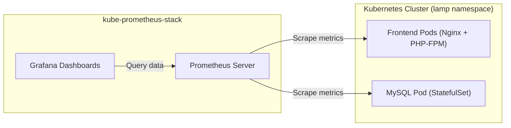

# Monitoring & Observability Setup for LAMP Stack

This directory provides configuration guidelines for setting up Prometheus and Grafana monitoring on the Kubernetes cluster.

## Architecture



## Setup Instructions

### 1. Install Prometheus Operator & Grafana via Helm

```bash
# Add Helm repo
helm repo add prometheus-community https://prometheus-community.github.io/helm-charts
helm repo update

# Install kube-prometheus-stack in monitoring namespace
helm install prometheus prometheus-community/kube-prometheus-stack \
  --create-namespace \
  --namespace monitoring \
  -f prometheus-values.yaml
```

### 2. Accessing Dashboards

```bash
# Port-forward Grafana to localhost
kubectl port-forward svc/prometheus-grafana 8080:80 -n monitoring
```

Navigate to `http://localhost:8080` (Default credentials: `admin` / `prom-operator`).

Import standard dashboards for:
- **Kubernetes Pod Overview**: CPU/Memory utilization per pod.
- **Nginx / PHP-FPM Metrics**: HTTP request rate, response time distribution.
- **MySQL Overview**: Active connections, query throughput, buffer pool utilization.
